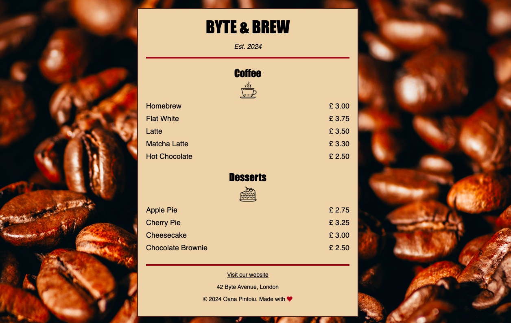

# Byte & Brew Cafe Menu Concept

This repository contains the HTML and CSS files for the BYTE & BREW Cafe Menu concept. The menu is designed to be a simple, elegant representation of a cafe's offerings. The design features a modern layout with icons and a background image to enhance the visual appeal.

## Table of Contents

[Result](#result) | [Features](#features) | [Technologies Used](#technologies-used) | [Installation](#installation) | [Usage](#usage) | [Credits](#credits) 

## Result

## Features

### 🎨 Background and Font Styling

- **Background Image**: A picture of coffee beans is set as the background for a cozy feel. This is done with `background-image` and `background-size: cover`, which ensures the image covers the whole screen.
- **Font Styling**: A clean and readable font is chosen for normal text and a bold, impactful font for headings. This is done with `font-family: sans-serif` and `font-family: Impact, serif`.

### 📏 Responsive Design

- **Container Sizing**: The menu adjusts to fit the screen size. It’s set to take up 80% of the screen width but not more than 500 pixels wide, thanks to `width: 80%` and `max-width: 500px`. This ensures it looks good on both small and large screens.
- **Padding and Margins**: Space is added around and inside the menu using `padding` and `margin` so everything doesn’t feel too cramped.

### 🎯 Alignment and Layout

- **Center Alignment**: The text and images are centered on the page. This is achieved with `text-align: center` for text and `margin: auto` for images and containers.
- **Inline-Block Layout**: For the menu items, `display: inline-block` is used, which makes the prices line up nicely next to the item names.

### 🌈 Color Scheme and Icons

- **Color Palette**: Soft background colors with darker text colors are used to make everything easy to read.
- **Icons**: Little icons are added next to the coffee and dessert sections to make the menu more fun and easy to understand. This is done with `` tags and setting their sizes.

## Technologies Used

- HTML
- CSS
- Font Awesome (for icons)

## Installation

1. Clone the repository.
2. Navigate to the project directory.
3. Open `index.html` in your web browser to view the menu.

## Usage

### Viewing the Menu

To view the menu, open `index.html` in your web browser. This will display the cafe menu with its background, layout, and icons as designed.

### Editing the Menu

To edit the menu items or prices, open the `index.html` file in your code editor and modify the relevant sections under `<section>` tags for Coffee and Desserts.

### Customizing the Styles

To change the styles, edit the `styles.css` file. You can modify the background image, font styles, colors, and layout by adjusting the CSS properties.

## Credits

Initially designed, written and tested with [FreeCodeCamp](https://www.freecodecamp.org/opin). This mini project is part of the Responsive Web Design Certification, which teaches HTML (Hypertext Markup Language) for content, and CSS (Cascading Style Sheets) for design. Current project has been altered to 

### Modifications

1. Personalized the design and make it unique.
2. Improved visual appeal.
3. Enhanced CSS efficiency for better performance and maintainability.

These changes were made to both personalize the project and improve upon the initial design, ensuring a more polished and efficient final product.
